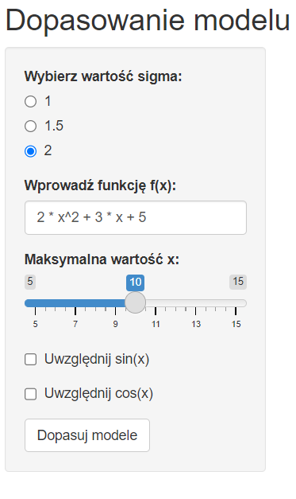

```{r setup, include=FALSE}
knitr::opts_chunk$set(echo = FALSE)
```

## Wstęp {.flexbox .vcenter}

Aplikacja Shiny została stworzona w celu umożliwienia interaktywnej analizy regresji liniowej. Regresja liniowa to technika statystyczna wykorzystywana do modelowania związku między jedną zmienną zależną (Y) a jedną lub kilkoma zmiennymi niezależnymi (X). Celem analizy regresji jest zrozumienie i opisanie tego związku, a także prognozowanie wartości zmiennej zależnej na podstawie zmiennych niezależnych.


#### **Używane pakiety**

```{r,echo=TRUE}
library(shiny)
library(ggplot2)
library(nortest)
```


## Działanie

<div style="font-size: 18px; line-height: 1.2; ">
Pokażemy teraz na przykładzie, jak działa część "statystyczna" projektu. Najpierw użytkownik wpisuje funkcję, do której zostanie dopasowany model oraz wybiera sigmę oraz przedział na osi X. Dla naszego przykładu przyjmę sigmę=2 oraz maxX=10. Naszą funkcją natomiast będzie: $$f(x) = x^2 + 2x + 3$$

</div>


```{r,echo=TRUE,out.height='800px',out.width='300px'}

set.seed(123)
maxX <- 10 #wybrana przez użytkownika wartość x
sigma <- 2 #wybrana przez użytkownika sigma

x <- runif(300, min = 0, max = maxX) 
#generowanie 300 wartości z rozkładu normalnego

# Definiowanie funkcji kwadratowej
functionInput <- "x^2 + 2*x + 3" #wybrana funkcja
y_true <- eval(parse(text = functionInput)) 
#tworzenie 300 wartości błędów
error <- rnorm(300, mean = 0, sd = sigma) 
data <- data.frame(x = x, y = y_true + error) 


```

## Wygenerowane dane   
```{r}
if (!is.null(data)) {
  ggplot(data, aes(x = x, y = y)) + geom_point() + labs(title = "Wykres danych")
} else {
  ggplot() + labs(title = "Wykres danych")
}
```


## Dopasowanie modelu
<div style="font-size: 18px; line-height: 1.2; ">
```{r,echo=TRUE,results='hide'}

model_formula <- as.formula(paste("y ~ x + I(x^2) + I(x^3) + sin(x) + cos(x)"))
initial_model <- lm(model_formula, data = data)
  
step_result <- step(initial_model)
```
Powyższy kod używa funkcji `lm()`, aby dopasować do naszych danych funkcję. Teraz zostaną pokazane współczynniki naszego dopasowanego modelu:
</div>

```{r,echo=TRUE}
(step_result$coefficients)
```

  
## Wykres dopasowanego modelu   

```{r}
  
data_pred <- data
    data_pred$y_predicted <- predict(step_result)
    ggplot(data_pred, aes(x = x)) +
      geom_point(aes(y = y), color = "blue") +
      geom_line(aes(y = y_predicted), color = "red") +
      labs(title = "Wykres danych i dopasowanych wartości")

```

## Sprawdzanie normalności 

```{r,echo=TRUE}
residuals <- residuals(step_result)
      normal_test <- ad.test(residuals)
      if (normal_test$p.value < 0.05) {
        "Reszty NIE są zgodne z rozkładem normalnym"
      } else {
        "Reszty są zgodne z rozkładem normalnym"
      }
```
<div style="font-size: 18px; line-height: 1.2; ">
Powyższy kod za pomocą testu normalności Andersona-Darlinga sprawdza czy reszty naszego modelu są lub nie są zgodne z rozkładem normalnym. Warto wspomnieć o założeniach testu normalności Andersona-Darlinga:
</div>
<div class="columns-2" style="font-size: 16px; line-height: 1.2; font-color=red; ">
###
-Dystrybucja teoretyczna

-Dane ilościowe

-Brak zakłóceń

###
-Nieobciążone dane

-Kategorie nieprzekraczalne

-Poziom istotności

</div>

## Wykres normalności reszt
```{r,echo=TRUE}
qqnorm(step_result$residuals)
      qqline(step_result$residuals)
```


# Teoretyczne Założenia A.R.L:

## 1.	Liniowość


Model regresji liniowej zakłada, że zależność między zmiennymi niezależnymi a zmienną zależną jest liniowa. To oznacza, że zmiana jednostkowa w zmiennej niezależnej powoduje stałą zmianę w zmiennej zależnej, niezależnie od jej wartości. W aplikacji używany jest model liniowy postaci: **y = Ax + Bx^2 +Cx^3 +D^x4 +Esin(x) + Fcos(x) + e**, a do dopasowania tego modelu używana jest funkcja **lm()**:


```{r message=FALSE, warning=FALSE,echo=TRUE}
#model_formula <- as.formula("y ~ I(x) + I(x^2) + I(x^3)")
#initial_model <- lm(model_formula, data = data())


```


## 2. Liczba obserwacji

Musi być większa bądź równa liczbie parametrów wyprowadzonych z analizy regresji (współczynniki dla predyktorów, wyraz wolny. W praktyce zakłada się, że powinno być **co najmniej 15, 20 obserwacji** na jedną zmienną w modelu regresji. 

## 3. Homoskedastyczność

Założenie o równości wariancji reszt (błędów modelu) dla wszystkich poziomów zmiennych niezależnych. Innymi słowy, oczekujemy, że rozrzut reszt wokół dopasowanej linii jest stabilny i nie zależy od wartości zmiennych niezależnych.
NP.  dla x^2 + e

```{r,echo=TRUE,eval=FALSE,results='hide'}
library(ggplot2)
residuals_vs_fitted<-ggplot(data=data,aes(x=fitted(initial_model),y=

residuals(initial_model))) +
 geom_point() +
labs(x ="Fitted values",y="Residuals",title="Residuals vs Fitted")
print(residuals_vs_fitted)

```

## 
<div class = "center" style="width: 800px">
```{r}
library(ggplot2)
residuals_vs_fitted<-ggplot(data=data,aes(x=fitted(initial_model),y=

residuals(initial_model))) +
 geom_point() +
labs(x ="Fitted values",y="Residuals",title="Residuals vs Fitted")
print(residuals_vs_fitted)

```
</div>

## 4.	Brak autokorelacji

Reszty modelu są niezależne od siebie. Innymi słowy, brak jest wzorca w pozostałościach, nie występuje zależność pomiędzy resztami dla różnych obserwacji.

```{r,echo=TRUE,out.height='70%',out.width='70%', fig.align='center'}
acf(residuals(step_result))
```


## 5.	Reszty mają rozkład zbliżony do rozkładu normalnego

Normalność rozkładu reszt możemy oszacować korzystając z testów normalności, takich jak: test Shapiro-Wilka, test Kołmogorowa-Smirnowa. My natomiast używamy testu Andersona-Darlinga.
```{r,echo=TRUE,out.height='50%',out.width='50%', fig.align='center'}
qqnorm(residuals(step_result))
```


# Interfejs Użytkownika (UI)

## Wygląd {.flexbox .vcenter}


```{r, echo=FALSE, out.width="100%", fig.align="center"}
knitr::include_graphics("Wyglad.png")
```


## 

<div class="columns-2" style="font-size: 18px; line-height: 1.2; font-color=red; ">

### 




###

-**RadioButtons ("sigma"):** Pozwala użytkownikowi wybrać wartość parametru sigma, który wpływa na poziom szumu w danych.

-**TextInput ("functionInput"):** Pozwala użytkownikowi wprowadzić funkcję f(x), która reprezentuje relację między zmiennymi.

-**SliderInput ("maxX"):** Pozwala użytkownikowi ustawić maksymalną wartość x w generowanych danych.

</div>

## 

<div class="columns-2" style="font-size: 18px; line-height: 1.2; font-color=red; ">


###


###

-**CheckboxInputs ("includeSin", "includeCos"):** Pozwalają użytkownikowi uwzględnić dodatkowe składniki funkcji sinus i cosinus w modelu.

-**ActionButton ("fitButton"):** Uruchamia proces dopasowywania modelu po kliknięciu.

## MainPanel

Zawiera wykresy danych, dopasowanego modelu, podsumowania modelu i wyniki testu normalności.


```{r, echo=FALSE, out.width="60%", fig.align="center"}
knitr::include_graphics("Wykresy.png")
```


## MainPanel

```{r, echo=FALSE, out.width="75%", fig.align="center"}
knitr::include_graphics("Reszty.png")
```
```{r, echo=FALSE, out.width="75%", fig.align="center"}
knitr::include_graphics("Wspołczynniki.png")
```

## Źródła

- [link]https://www.naukowiec.org/wiedza/statystyka/zalozenia-analizy-regresji-liniowej_439.html?fbclid=IwAR37ZSTLaO0yb3Uqt9-bFIOD4zSSKe6BeKw2HeDNLU7ABOa8it2DhORC4f8


#### **Podział pracy**

-Szymon Popkiewicz - aplikacja Shiny

-Kacper Prorok - prezentacja

